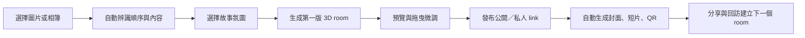
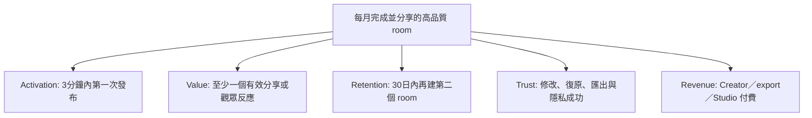

# 精緻 3D Gallery／故事相簿產品研究與商業分析

**研究日期：2026-08-28**  
**研究範圍：全球英文市場；第一個產品假設為無程式碼 Web MVP；後續評估手機 App**  
**核心問題：如何把「替換圖片、修改 `index.html` 常數清單」變成一般創作者可以完成的 Fountain experience？**

---

## 0. 執行摘要

你的 Reddit 對話提供了一個有價值、但尚未足以證明大市場的訊號：使用者不是不想要漂亮的 3D gallery，而是無法把「可運作的原始碼」轉成「我可以自己更新的作品」。對熟悉程式的人，將 `a.png` 換成 `b.png` 並同步改描述很簡單；對不熟悉的人，這裡同時包含檔名、路徑、格式、大小寫、陣列語法、部署與快取等多個可能失敗點。真正的產品機會不是再提供一份 recipe，而是把 recipe 變成一個可預覽、可復原、可分享的內容編輯流程。

目前的市場證據支持以下結論：

1. **需求訊號存在，而且跨越 Reddit 與藝術工具市場；但不能宣稱 Facebook、Reddit、藝術論壇已經「大量」證明需求。** Reddit 有直接的建造與求助訊號；藝術平台已有付費虛擬展覽；Facebook 的公開可索引內容很少，登入牆與群組可見性使公開搜尋不能代表整個 Facebook。
2. **現有供應商大多解決「建立一個虛擬展覽」或「賣藝術」；較少把產品做成低摩擦的「把手機相簿變成一個有氣氛的 3D 故事」。** ArtPlacer、Kunstmatrix、Artsteps 偏專業展覽／藝術業務；Galerra、MyGallery3D、OpenVGal 更接近自動生成與分享；Journi、Day One、SCRL 解決照片故事或分享，但不是可行走的 3D 空間。
3. **第一個 wedge 應是「一分鐘內生成一個可分享的 3D story room」，不是「另一個完整虛擬博物館」。** 先把匯入、理解、佈局、預覽、分享做得極好，再增加售賣、社群、多人、品牌白標。
4. **Fountain over Tap 的正確解讀不是無限堆特效，而是讓使用者獲得超出預期的情緒價值。** Tap 是「我上傳幾張圖」；Fountain 是「我得到一個具有節奏、空間、敘事與可分享記憶的作品」。多餘的 3D 複雜度會反過來成為成本，而不是 Fountain。
5. **建議的 MVP：** 手機或桌面拖放圖片 → 自動依 EXIF／檔名／上傳順序分組 → 選一個氛圍與故事提示 → 自動生成一個 room → 使用者只需改標題、圖片順序、描述 → 一鍵發布公開／不公開 link → 生成短片、封面與社交預覽卡。原始碼可匯出，但不是主要編輯介面。
6. **最佳商業起點：freemium + creator pro subscription + paid export／print，外加服務與 API 白標。** 不要一開始依賴廣告或藝術品交易佣金；先證明「生成—分享—回訪—再生成」循環。

最重要的反證也要保留：一個人說「barely understood」可能是 onboarding 不清楚，也可能只是對這個產品沒有足夠強的使用動機。必須用可操作 prototype 測試，而不是把所有問題都歸因於懶惰。研究建議把她視為「任務失敗的觀察者」，不是「懶惰使用者」。

---

## 1. 原始問題拆解：從改檔名到產品需求

### 1.1 目前 recipe 的實際流程

**本次本地檢查備註：** 在目前 workspace 與 `/Users/nosensetxt/mvp` 的可見檔案中，沒有找到可辨識的 3D gallery repository、GitHub URL 或對應的 `index.html`。因此以下是根據你提供的操作描述建立的 workflow analysis，不是對某個未提供的 repo 做過的逐行 code audit。若之後提供 repo URL 或本地路徑，應另做一次真實 UI、資料流與部署檢查。

假設原始 gallery 將媒體與說明寫在 `index.html` 或相關 JavaScript 常數中，使用者需要：

1. 找到正確的 repository。
2. 找到圖片資料夾。
3. 替換或新增圖片。
4. 確認檔案副檔名、大小寫與相對路徑。
5. 找到 `index.html` 中的常數陣列。
6. 將 `a.png` 改為 `b.png`。
7. 將 `a.png` 對應的描述改成 `b.png` 的資訊。
8. 保持引號、逗號、括號與編碼正確。
9. 在本地或 GitHub Pages 預覽。
10. 發布更新，處理快取或建置錯誤。

工程師將這看成一個很短的 diff；一般創作者會把它看成十個可能破壞 gallery 的未知風險。這是典型的「系統很簡單，但心智模型很難」問題。

### 1.2 使用者真正想買的是什麼

不是「一個圖片陣列編輯器」，而是：

- 我有一批照片／作品，想快速變成有氣氛的展示。
- 我不想學 Git、HTML、檔案路徑或部署。
- 我想保留作品的順序、標題與故事。
- 我想先看到結果，再決定是否發布。
- 我想把 link 傳給朋友、客戶或觀眾。
- 我想在手機上開始，之後在桌面微調。
- 我不希望工具把我的作品變成俗氣的 template slideshow。
- 我希望作品仍然「像我」，而不是 AI 替我做出一個千篇一律的展覽。

### 1.3 不應採用的假設

「她可以理解，只是懶」是一個需要被質疑的假設。較好的產品研究問題是：

- 她是否知道任務的成功標準？
- 她是否相信改錯可以復原？
- 她是否需要先看到結果才願意學？
- 她是否使用手機而不是桌面？
- 她是想要一個永久 portfolio，還是只想做一次漂亮分享？
- 她能否說出她想讓觀眾感受到什麼？

若 5 位目標使用者中有 4 位在不看說明下完成第一次發布，問題才算被產品解決；不是把說明寫得更長。

---

## 2. 跨平台需求訊號：Reddit、Facebook、藝術論壇

### 2.1 研究方法與證據等級

本次以公開可索引頁面、平台官方頁面與搜尋結果做 desk research。證據分三層：

- **A：直接使用者行為／明確求助。** 使用者直接詢問如何做、要求更簡單工具，或分享自己做的 3D gallery generator。
- **B：供應商已經收費提供相同或鄰近能力。** 能證明有人把這個問題包裝成產品，但不能單獨證明你的細分市場願意付費。
- **C：搜尋摘要、展示作品或間接討論。** 只能作為方向訊號，不能作為市場規模證明。

本報告沒有把搜尋結果數量當成需求量，也沒有把一個 Reddit post 當成統計樣本。

### 2.2 Reddit：最強的公開需求訊號

找到的 Reddit 訊號包括：

| 訊號 | 觀察 | 證據強度 | 產品含義 |
|---|---|---:|---|
| `r/threejs` 的 3D art gallery generator | 使用者描述「drop in a bunch of images and it generates a 3D art gallery you can scroll through」 | A | 圖片匯入→自動 gallery 是自然語言需求，不只是工程展示 |
| `r/vibecoding` 的 3D image gallery | 開始是 3D photo wall，後來加入 directory upload、IndexedDB、縮圖 | A | 建造者自己也會從 demo 走向上傳、持久化與內容管理 |
| `r/vibecoding` 的 3D portfolio | 分享 CSS／React 的 3D portfolio，重點包含 responsive 與 mobile adaptive motion | A | 「好看且手機可用」是展示型工具的基本門檻 |
| `r/webdev` 的 photo gallery system | 需求包含登入、從 web interface 上傳、建立 galleries、嵌入網站、JPG／PNG | A | 真正的痛點是內容管理和更新，不只是首次建站 |
| `r/InteractiveWebsites` 的 interactive portfolio | 使用者分享可探索的 3D／magic-wand portfolio | B/A | 觀眾端對互動體驗有興趣，但不等同於創作者端願意編輯 |
| `r/ContemporaryArt`／`r/artbusiness` 的 virtual gallery 討論 | 使用者詢問 ArtPlacer 或其他 virtual exhibition 工具 | A | 藝術業務已有明確比較與購買意圖 |
| `r/virtualreality` 對可邀請朋友一起走 gallery 的詢問 | 直接提出「create your own art gallery and invite friends to walk through it together」 | A | 多人參觀是後續需求，但不宜放進第一個 MVP |

可核對的 Reddit 來源：

- [I built a 3D art gallery generator](https://www.reddit.com/r/threejs/comments/1qrarnb/built_a_3d_art_gallery_generator/)
- [Created this 3d image gallery with vibe coding](https://www.reddit.com/r/vibecoding/comments/1uxpujc/created_this_3d_image_gallery_with_vibe_coding/)
- [I built a 3D Portfolio Gallery using React + CSS transforms](https://www.reddit.com/r/vibecoding/comments/1pf5lkr/i_built_a_3d_portfolio_gallery_using_react_css/)
- [Looking for recommendations for a photo gallery system](https://www.reddit.com/r/webdev/comments/12y18kt)
- [Virtual gallery?](https://www.reddit.com/r/ContemporaryArt/comments/15xgkfw)
- [An app where you can create your own art gallery and invite friends](https://www.reddit.com/r/virtualreality/comments/15xgkfw)

**判斷：** Reddit 已經足以支持「需求語句和建造行為存在」，但不足以支持「市場很大」或「藝術家普遍需要 3D」。最值得測試的是「不熟悉程式的人能否在 60 秒內把自己的媒體發布出去」。

### 2.3 Facebook：不能把低可見度誤判為沒有需求

公開搜尋沒有得到足夠可驗證的 Facebook 群組貼文，原因可能包括：

- 大量藝術群組需要登入或加入後才能看。
- Facebook 對搜尋引擎的群組內容索引不完整。
- 貼文、留言與群組名稱可能因地區、登入狀態或隱私設定而不同。

因此本次的結論不是「Facebook 沒有需求」，而是：**公開 web evidence 不足，不能宣稱 Facebook 上已廣泛表達這個需求。** 若要驗證 Facebook，應進行一個手動、合規的 research sprint：選定 10–15 個公開藝術／攝影／創作者群組，記錄近 12 個月中與「portfolio website、virtual exhibition、photo story、no-code gallery、website update」相關的貼文數、留言中的痛點與是否出現付費工具推薦。不要只記錄讚數，因為演算法曝光會扭曲比較。

### 2.4 藝術論壇與藝術工具市場

藝術工具供應商的存在本身是較強的市場化訊號：

- **Artsteps** 宣稱可免費建立 VR experience，使用者可上傳圖片、影片、文字、3D model，建立牆面和材質，加入音樂／旁白／導覽點，並以 link、社交媒體或 embed 分享；其 premium services 包含私人 web space、客製 3D design、curation 與虛擬活動。[Artsteps 官方介紹](https://www.artsteps.com/bot/bots.html)
- **Kunstmatrix** 讓使用者從 room template 加入 paintings、sculptures、video、sound；免費方案不能公開分享，Basic 為每月 €10、50 件作品、5 個公開 3D exhibitions，Regular €25、250 件作品、10 個公開 exhibitions，Professional €50、500 件作品、50 個公開 exhibitions。[Kunstmatrix 官方定價](https://www.kunstmatrix.com/en/pricing)；[公開展覽 FAQ](https://www.kunstmatrix.com/en/info/faqs/what-is-a-public-3d-exhibition-what-does-public-mean)
- **ArtPlacer** 把 3D virtual exhibitions、room mockups、AR、portfolio presentation、collector management、website integrations 放進同一個藝術業務工具；Artist Basic 顯示約 $9/月、50 件作品，Standard 約 $16/月，Plus 約 $27/月並包含 unlimited virtual exhibitions，專業方案由約 $45/月起。[ArtPlacer 官方產品頁](https://www.artplacer.com/)、[官方定價](https://www.artplacer.com/pricing/)
- **Galerra** 將價值主張壓縮為「上傳作品，約 60 秒得到可行走的 3D gallery」，並強調 no code、free、0% commission；其公開頁面顯示 1,169 artists、354 galleries、3,643 artworks，這些是供應商自報數字，不能當成獨立審計的市場規模。[Galerra](https://galerra.art/)
- **MyGallery3D** 面向 art、photos、products、portfolio，主張 AI 代為把作品掛上牆並生成介紹，約一分鐘完成；Pro 可加 logo、色彩、去除 badge、embed。[MyGallery3D](https://mygallery3d.com/)
- **OpenVGal** 以「從 images 建立自己擁有的 3D virtual gallery」為主張，免費建立、$9/月發布，並強調 self-hosting／own your art。[OpenVGal](https://openvgal.com/)
- **Viewly** 提供 dedicated address、embed、QR code、訪客統計與 chat，並以 ambassador program 提供部分免費額度。[Viewly](https://viewly.art/)
- **New Art City** 代表更偏實驗性、多人、數位藝術與線上展演的方向，其公開頁面提及 online editor toolkit 與 multiplayer website。[New Art City](https://newart.city/)

**論壇與市場含義：** 現有工具已證明「虛擬展示」不是幻想，但它們也把產品問題暴露出來：專業工具的設定、空間、價格與內容模型，對一個只想把 12 張圖片變成漂亮 link 的人可能太重。

### 2.5 需求總結：廣泛嗎？

最準確的結論是：

> 「建立、更新、分享一個比普通 grid 更有感覺的 3D／虛擬 gallery」在公開社群和商業供應商中有跨平台訊號；「大量普通創作者願意使用你這個特定 gallery」尚未被證明。

需求應拆成三個可驗證假設：

1. **可用性假設：** 非程式使用者能在 60 秒內完成第一次 gallery。
2. **價值假設：** 他們認為「3D 空間＋故事」比單純 grid、carousel 或 PDF 更值得分享。
3. **留存假設：** 他們每月會因新作品、旅行、專案、活動或收藏而回來建立／更新新的 story room。

---

## 3. Labubu 創辦人訪談：Fountain vs Tap 的來源與產品解讀

### 3.1 先處理關鍵不確定性

你提供的搜尋線索是「fountain tap allergy」。目前沒有找到以 “allergy” 為關鍵詞的可靠原始訪談；較可能是把 **allegory**（寓言／比喻）或文章中的 **fountain versus dripping tap** 記憶成 allergy。公開網頁中，最直接出現這個比喻的是 Dao Insights 2025 年文章，文章將它歸於 Pop Mart 創辦人王寧的產品思考，但它不是王寧官方逐字稿。[Dao Insights: How Pop Mart turned “useless” toys into a billion-RMB business](https://daoinsights.com/news/how-pop-mart-turned-useless-toys-into-a-billion-rmb-business/)

所以本報告採用以下證據分級：

- **已核實背景：** 王寧是 Pop Mart founder／CEO；人民日報海外版／新華網發布了 2025 年對他的訪談，談到從潮玩、IP、文化、出海與體驗擴張。[新華網轉載的人民日報海外版訪談](https://www.news.cn/20250723/4ea2957a9cbb4fc08fc3b89a2bec6888c.html)
- **可用但非一手原文的比喻：** Dao Insights 將「裝飾性 fountain 浪費的水比 dripping tap 多，但人不介意」寫成其產品觀的例子。
- **不能確認：** “fountain tap allergy” 不是目前可核實的訪談名稱；不能宣稱這是正式產品設計框架或王寧的精確原話。

### 3.2 這個比喻對本產品的正確轉譯

| Tap | Fountain |
|---|---|
| 把圖片放進網頁 | 讓作品進入一個有節奏的空間 |
| 功能正確 | 產生值得保存／分享的情緒 |
| 使用者自己管理檔名和描述 | 系統自動處理檔案，使用者只做有意義的選擇 |
| 一次性 template | 可以持續建立新的 story rooms |
| 工程師覺得足夠 | 觀眾覺得「我想把這個傳給某人」 |
| 清楚的工具 | 具有世界觀的產品 |

Fountain 不是單純加入粒子、音效、相機晃動或更複雜的 WebGL。那些是表面效果。真正的 fountain 必須是：

1. **輸入很普通，輸出很有感覺。** 12 張手機圖片可以變成一個有開場、高潮、停頓和結尾的房間。
2. **使用者仍然有作者感。** 自動化提供第一版，不奪走排序、剪裁、標題與氛圍的主導權。
3. **分享是作品的一部分。** 不是最後才加一個 URL，而是自動生成 cover、短片、QR card 和可嵌入預覽。
4. **有回訪理由但不操控。** 新的旅程、展覽、客戶專案、生日、季節與作品集都可以自然產生新的 room。

### 3.3 Pop Mart 的可借鑑部分與不可照抄部分

可借鑑：

- 把看似「無用」的 aesthetic experience 變成情緒與文化產品。
- 從單件商品擴展到 IP、活動、展覽、社群與空間體驗。
- 讓產品的故事比功能規格更容易被記住。
- 用新奇體驗吸引第一次嘗試，再用系列化內容產生回訪。

不可照抄：

- 盲盒的不確定性、稀缺性與收藏壓力不適合直接搬到創作者工具。
- 「上癮」不應變成社交比較、FOMO、付費抽取或無限通知。
- 玩具的價值可以脫離實用性；創作者工具仍必須先完成可靠上傳、保存、隱私、分享和匯出。

---

## 4. 市場解決方案地圖

### 4.1 四種現有解決方案類型

**A. 程式碼模板／開源 repo**

- 優點：成本低、視覺可完全客製、可自託管、資料所有權清楚。
- 缺點：每次更新都要懂檔案、路徑、部署；使用者沒有內容管理介面；作者要維護 browser compatibility。
- 適合：開發者、創意 coding 學習者、一次性客製專案。

**B. 專業虛擬展覽平台**（Artsteps、Kunstmatrix、ArtPlacer）

- 優點：房間模板、作品管理、公開 URL、embed、銷售／收藏家功能、商業支持。
- 缺點：設定重、通常按月付費、偏畫廊與展覽流程；普通人只是想做一次故事相簿時，功能過量。
- 適合：藝術家、畫廊、策展人、教育與企業活動。

**C. 自動化 3D gallery 生成器**（Galerra、MyGallery3D、OpenVGal）

- 優點：接近無程式碼，上傳後迅速得到 room，直接命中本案核心。
- 缺點：差異化可能不足；品質、編輯控制、資料持久性、品牌所有權、長期留存與商業規模需另行核查。
- 適合：想快上線的藝術家、攝影師、作品集與小型商家。

**D. 影像故事／相簿／社交工具**（Journi、Day One、SCRL、Mixbook）

- 優點：手機先行、輸入低摩擦、故事與分享習慣成熟；Journi 可把照片變成 photo book，Day One 有 private／shared journals，SCRL 讓使用者製作可分享的 photo carousel。[Journi](https://www.journiapp.com/blog)、[Day One Shared Journals](https://dayoneapp.com/shared-journals/)、[Day One features](https://dayoneapp.com/features/)、[SCRL](https://scrl.com/?hsLang=en)
- 缺點：不是可探索的 3D room；通常以時間軸、頁面、carousel 或印刷品為主；對作品的空間氣氛不足。
- 適合：旅行、家庭記憶、社交貼文、印刷相簿。

### 4.2 建議的市場空位

一個較清楚的 white space 是：

> **「Instagram／PDF 之外，一分鐘建立一個細膩 3D story room；不用 3D 建模、不用 Git、不用學虛擬展覽軟體；一個 link 就能分享。」**

它不是要在所有功能上打贏 ArtPlacer，也不是要在印刷上打贏 Journi，而是把「美學空間」與「手機故事輸入」放在同一個低摩擦流程。

### 4.3 競品比較

| 方案 | 首次產出速度 | 3D／空間感 | 手機輸入 | 故事／文字 | 發布分享 | 編輯控制 | 主要缺口 |
|---|---:|---:|---:|---:|---:|---:|---|
| 原始 GitHub repo | 低 | 高 | 低 | 中 | 需自行部署 | 高但需懂 code | 非程式使用者無法維護 |
| Artsteps | 中 | 高 | 低至中 | 高 | 高 | 高 | 對一次性輕量故事偏重 |
| Kunstmatrix | 中 | 高 | 中 | 中 | 付費公開 | 中至高 | 需訂閱才公開、偏專業展覽 |
| ArtPlacer | 中 | 中至高 | 中 | 高 | 高 | 高 | 功能和價格偏藝術業務 |
| Galerra | 高 | 高 | 中 | 中 | 高 | 待核查 | 品牌、故事深度、長期 ownership 待驗證 |
| MyGallery3D | 高 | 高 | 中 | AI 輔助 | 高 | 中 | 自動化後的作者控制待驗證 |
| OpenVGal | 中至高 | 高 | 中 | 中 | $9/月發布 | 中 | 仍可能需要理解 gallery 概念與設定 |
| Journi | 高 | 低 | 高 | 高 | 高／可印刷 | 中 | 沒有可行走 3D 空間 |
| Day One | 高 | 低 | 高 | 高 | 受邀分享 | 中 | 更像 journal，不是公開 gallery |
| SCRL | 高 | 低至中 | 高 | 低至中 | 社交導向 | 中 | 社交貼文，而非長期作品空間 |
| **建議產品** | **極高** | **高但有限定風格** | **高** | **高** | **一鍵** | **有意義的少量控制** | 需要證明留存和付費 |

---

## 5. 痛點分析

### 5.1 原始 repo 的痛點

| 痛點 | 使用者感受 | 嚴重度 | 解法 |
|---|---|---:|---|
| 不知道改哪個檔案 | 「我怕改壞」 | 高 | onboarding 直接提供內容編輯器，不暴露 repo |
| 檔名與內容不同步 | 圖片空白、錯圖或描述錯置 | 高 | upload 時建立 asset ID，不用以檔名作主鍵 |
| 副檔名／大小寫／路徑錯誤 | 在一台機器有效，發布後失效 | 高 | 自動處理、檢查、重新命名、CDN URL |
| 沒有預覽與復原 | 不敢試 | 高 | draft、preview、version history、undo |
| 部署流程陌生 | 內容改了但觀眾看不到 | 高 | Publish 按鈕、狀態明確、錯誤解釋人話 |
| 文字描述要手寫 | 作品很多時很累 | 中 | 可選 AI caption，但要先預覽和編輯 |
| 手機工作流斷裂 | 圖片在手機，code 在桌面 | 高 | mobile-first upload、桌面只做精修 |
| 3D 導覽可能暈或難用 | 觀眾離開 | 高 | 2D／guided mode、reduced motion、觸控和鍵盤支援 |
| 貼圖或作品被下載 | 創作者擔心被盜 | 中至高 | 清楚的隱私、壓縮預覽、watermark／禁止下載不能承諾絕對防盜 |

### 5.2 現有解決方案的痛點

**Artsteps／Kunstmatrix／ArtPlacer：**

- 對「一個漂亮的 12 圖故事」可能過於專業。
- 要理解 room、exhibition、artwork catalog、公開權限或 embed。
- 收費公開或付費升級會延後第一次分享。
- 3D 空間越自由，越容易把創作者變成場景佈置者。

**Galerra／MyGallery3D／OpenVGal：**

- 供應商頁面承諾很低摩擦，但要實測自動排版是否真的保留作者意圖。
- 「AI 幫你寫介紹」可能產生泛化、錯誤或不符合藝術家聲音的文字。
- 免費／低價若依靠平台 badge、品牌或未來升價，使用者會擔心 lock-in。
- 尚需驗證匯出、自託管、原始檔案所有權與服務持續性。

**Journi／Day One／SCRL：**

- 輸入與故事很流暢，但 3D 空間感不足。
- 相簿和 journal 已經有很強的使用習慣與社交分發，新的 3D 產品必須提供明顯增量，不可只把 carousel 換成房間。
- 印刷相簿能帶來高價值實物；純數位 3D gallery 需要回答「為什麼我不直接發 Instagram／Behance／網站？」

### 5.3 觀眾端痛點

- 第一屏不知道要做什麼。
- 3D 互動需要學習，尤其在手機上。
- 讀取慢、耗電、暈動或不支援低階裝置。
- 觀眾只想快速看內容，卻被迫走完整個房間。
- 作品描述被藏太深，或互動效果掩蓋作品本身。

產品應提供 **Fountain mode** 與 **Tap mode**：

- Fountain mode：自由探索、有空間、有氛圍。
- Tap mode：快速滑看、讀 caption、跳到指定作品、分享單件內容。

這不是退讓，而是讓不同意圖的觀眾都能完成任務。

---

## 6. Kano 分析

Kano 將功能分成 Must-be、Performance、Attractive、Indifferent、Reverse。這裡是針對「無程式碼 3D story gallery」的初步假設，不是訪談後的統計結論。

### 6.1 功能分類

| 功能 | 初步 Kano 類型 | 為什麼 | MVP 決定 |
|---|---|---|---|
| 上傳 JPG／PNG／HEIC | Must-be | 沒有內容就沒有 gallery | V1 必須 |
| 自動處理檔名與路徑 | Must-be | 直接消除原始 repo 最大失敗點 | V1 必須 |
| 保存草稿與自動備份 | Must-be | 使用者不能失去作品 | V1 必須 |
| 預覽後發布 | Must-be | 降低恐懼與錯誤 | V1 必須 |
| 公開／不公開／密碼 link | Must-be | 作品有不同隱私需要 | V1 必須 |
| 手機與桌面可用 | Must-be | 跨裝置是核心情境 | V1 必須 |
| 作品標題／描述／順序編輯 | Performance | 越快越可控越有價值 | V1 必須 |
| 自動生成 room | Performance | 速度與品質直接影響採用 | V1 必須 |
| 可自訂色彩／燈光／材質 | Performance | 創作者越在意品牌，價值越高 | V1 限定 3–5 組 preset |
| 一鍵生成 share card／短片 | Attractive→Performance | 會顯著推高分享 | V1 優先 |
| AI 分組、caption、排序建議 | Attractive | 第一次成功感強，但錯誤會傷信任 | V1 可選，必須可改 |
| QR code | Attractive | 實體展覽、名片、展場有用 | V1.5 |
| Embed widget | Performance（專業客戶） | 作品集與商業用戶重要 | V1.5 |
| 觀眾留言／reaction | Attractive | 可帶來回訪與社交回饋 | V2，先做簡單 reaction |
| 多人同步走房間 | Attractive／高成本 | 有活動價值但複雜 | V3 |
| 3D model、音訊、影片、旁白 | Performance（部分客群） | 可擴大創作者類型 | V1.5，先支援少量 |
| NFT／加密錢包 | Indifferent／Reverse | 會增加摩擦和市場風險 | 不放 MVP |
| 大量自由建模 | Reverse 對目標初學者 | 太多選擇會破壞 Fountain | 不放 MVP |
| 無限 template marketplace | Indifferent 初期 | 選擇過多延誤首次發布 | 先做少量 curated scenes |
| 觀眾廣告 | Reverse | 破壞 delicate aesthetic | 不做 |

### 6.2 Kano 驗證問卷／訪談設計

不要只問「你喜不喜歡」。對每個功能問 functional／dysfunctional pair：

- 如果有「上傳 12 張圖片後自動生成 3D room」，你感覺如何？
- 如果沒有這個功能，你感覺如何？
- 如果可以先看預覽再發布，你感覺如何？
- 如果不能預覽就必須發布，你感覺如何？

回答選項：喜歡、理所當然、無所謂、可以接受、不喜歡。第一輪至少訪談 12 人：4 位畫家／插畫家、3 位攝影／設計創作者、3 位一般照片故事使用者、2 位藝術業務／策展人。

### 6.3 Kano 結論

產品優先級不是「3D 越多越好」，而是：

1. 可靠內容生命週期：上傳、保存、預覽、發布、修改。
2. 自動生成讓第一次成功變得驚喜。
3. 低摩擦分享讓作品離開工具。
4. 足夠但不過量的作者控制，避免 template 同質化。
5. 社交、多人、交易等後續層建立在真實回訪上。

---

## 7. Sherlocking 分析：誰可能把這個功能內建？

「Sherlocking」不是指法律上的侵權，而是平台把原本由第三方提供的 workflow 直接納入自己的生態系，令獨立工具的分發或價值被壓縮。這個產品的風險很高，因為圖片、故事、分享與簡單版面都是大平台熟悉的能力。

### 7.1 可能的 Sherlocker

| 平台／類型 | 可能內建什麼 | 威脅 | 你不能只靠什麼防守 |
|---|---|---:|---|
| Apple Photos／Journal | 自動從照片生成故事、記憶、分享與列印 | 高，尤其手機入口 | 只靠「照片上傳」 |
| Google Photos | 分組、回憶、相簿、分享、AI 故事 | 高 | 只靠自動 caption |
| Canva | AI 設計、網站、簡報、影片、相簿 template | 高 | 只靠 template 數量 |
| Adobe／Behance | 作品集、portfolio、AI caption、展示頁 | 中至高 | 只靠藝術家帳號 |
| Instagram／TikTok | 3D／AR effects、carousel、story、分享 graph | 高分發、低空間深度 | 只靠「可以分享」 |
| Wix／Squarespace／Framer | AI website builder、CMS、gallery block | 高 | 只靠 no-code |
| Roblox／Fortnite／Spatial | 3D world、多人、creator economy | 中，偏重體驗 | 只靠 3D engine |
| ArtPlacer／Kunstmatrix／Artsteps | 自動排版、AI caption、手機工具 | 中至高 | 只靠「藝術 gallery」定位 |
| Journi／Mixbook／Day One | AI 故事與分享／印刷 | 中 | 只靠 photo book |

### 7.2 可防守的資產

最難被單一功能複製的不是「3D canvas」，而是複合 workflow：

1. **一套有辨識度的 delicate spatial language。** 固定的光、材質、攝影機節奏與可讀性，比無限模板更能形成品牌。
2. **創作者的故事資料模型。** 圖片、作品 metadata、版本、展覽、caption、分享資產、觀眾反應形成內容 graph。
3. **從手機素材到可分享 room 的速度與品質。** 大平台可以內建功能，但不一定願意專注在這個微小而高品味的 workflow。
4. **跨平台 export／embed／ownership。** 可下載静態 fallback、JSON manifest、圖片 metadata 與自訂 domain，降低 lock-in。
5. **特定社群與分發。** 例如每週 prompt、創作者 showcase、策展合作、學校／藝術院校與攝影社群。
6. **高品質的 human-in-the-loop 服務。** 商業客戶要的不只是工具，而是展覽上線、品牌一致、活動支援與資料安全。

### 7.3 Sherlocking 對路線圖的含義

- 不要以「我們有 AI caption」作為核心護城河。
- 不要和 Instagram 比所有社交功能。
- 不要與 Canva 比所有設計功能。
- 先把「3D story room 對某一批使用者的情緒與分享價值」做深。
- 讓使用者保有可匯出內容，因為信任本身就是產品差異化。
- 以 open gallery manifest、embed API 和可攜資料模型，使你的工具可以成為其他平台的空間層，而不是只能在自己平台內封閉運作。

---

## 8. 建議產品：Fountain-first、Tap-available

### 8.1 產品命名概念

暫名可用 **Fountain Gallery**、**Roomlet**、**Lumen Room** 或 **Aperture Rooms**。命名不宜讓使用者以為必須懂 VR、建模或藝術史；它應該暗示「進入一個小而精緻的空間」。

### 8.2 核心 promise

> 把手機裡的一組圖片，在一分鐘內變成一個你敢分享的 3D 故事房間。

### 8.3 首次使用流程



第一次不要要求：註冊一長串資料、選十幾個 template、輸入檔名、理解 scene graph、設定相機、輸入 CDN、連 GitHub 或先付費。

### 8.4 匯入與資料模型

不要以 `a.png`、`b.png` 作為內容主鍵。每個 asset 應有不可變 ID：

```json
{
  "id": "asset_01J...",
  "sourceName": "b.png",
  "displayTitle": "After the Rain",
  "description": "A quiet study in blue and silver.",
  "order": 2,
  "mediaUrl": "managed://asset_01J...",
  "altText": "Blue abstract painting with silver marks",
  "focalPoint": {"x": 0.5, "y": 0.45}
}
```

這樣使用者重新命名檔案不會破壞作品。系統可以保留原始檔名作為 debug metadata，但 UI 永遠顯示人可理解的標題。

### 8.5 Fountain layer

Fountain layer 是系統代勞的部分：

- 自動生成 room、牆面比例、光照和圖片尺度。
- 依圖片順序、色彩、時間或使用者故事 prompt 提出排列。
- 生成開場標題、作品 caption 草稿與結尾卡。
- 自動生成 mobile／desktop layout。
- 自動建立 10–20 秒的 walk-through preview video。
- 發布後產生 cover image、Open Graph preview、QR code。
- 每次更新保留版本，可以「回到昨天的 room」。

### 8.6 Tap layer

Tap layer 保留使用者直接控制的少量旋鈕：

- 替換一張圖片。
- 拖曳排序。
- 修改標題和描述。
- 選擇 3–5 種氛圍：quiet、dream、studio、night、archive。
- 調整亮度、文字顯示、導覽速度。
- 設定公開、私人、密碼或僅限邀請。

每個控制都應即時預覽，且提供「Reset to suggested」。

### 8.7 觀眾模式

- **Explore：** 3D walk-through、滑鼠／觸控／鍵盤、可點作品。
- **Story：** 系統引導鏡頭沿著故事順序走，適合手機與分享 link。
- **Quick view：** 2D fallback，快速查看全部作品、caption、下載或聯絡作者。
- **Reduced motion：** 遵守系統偏好，避免暈動與 accessibility 問題。

3D 不是唯一入口；如果作品只能在 3D 中觀看，產品會把美學負擔轉嫁給觀眾。

### 8.8 「更可能被試用與回訪」的健康循環

不使用操控性 addiction pattern，改用價值循環：

1. **First magic：** 60 秒內得到一個真的能分享的 room。
2. **Identity：** 使用者調一個氛圍、標題或房間名稱，產生作者感。
3. **Audience response：** 朋友或客戶可以留下 reaction／一句話，不必先註冊。
4. **Memory：** 系統顯示過去 room 的時間軸與版本，讓回訪有意義。
5. **Prompt：** 每週或每月可選 prompt，例如「three colours」「a quiet afternoon」「what changed」。頻率由使用者控制，可關閉通知。
6. **Expansion：** 同一批素材可生成 room、短片、封面、手機 wallpaper 或印刷 zine。

衡量的是使用者是否創造、分享、回來，而不是 notification click 或無限滾動時間。

### 8.9 MVP 範圍

**V0 concierge prototype（2 週）：**

- 使用者上傳 6–20 張圖片。
- 團隊或固定 pipeline 生成 3 個 room preset。
- 使用者只編輯標題、順序、caption。
- 發布單一 link，含 3D／2D fallback。
- 手動訪談使用者完成任務所需時間。

**V1 no-code Web（6–10 週）：**

- 帳號、drag-and-drop upload、資產庫、draft、preview、publish。
- 固定 scene library。
- metadata 與 alt text。
- 公開／私人 link、OG share card。
- export JSON manifest 與靜態 fallback。
- 基本 analytics：view、room complete、share click、作品 click。

**V1.5：**

- 手機 PWA 或原生薄 App。
- AI 分組與 caption 草稿。
- 短片／QR／embed。
- 多 room、collection、custom domain。

**V2：**

- 觀眾 reaction、guestbook、收藏、多人 guided tour。
- 商業客戶 workspace、品牌 preset、白標。
- 作品 inquiry／checkout link；不要自行處理藝術品交易，除非有清楚的合規與退款流程。

---

## 9. Photo book／故事相簿手機產品參照清單

這些不是全部直接競品，而是用來研究「手機輸入、故事形成、分享、印刷與回訪」的相鄰產品。

| App／產品 | 它做得好的事 | 可借鑑 | 不應直接照抄 |
|---|---|---|---|
| Journi | 從手機照片建立 shared journal、公開／私人故事、地圖與 photo book；AI 可協助排列 | 以手機相簿為入口；故事與印刷互相導流 | 3D room 仍是空白 |
| Day One | 個人 journal、Shared Journals、照片／影片／音訊、隱私和跨裝置；共享 journal 可邀請他人查看、留言或新增內容 | 私密與共享分開；邀請式回憶；內容 ownership | Day One 偏日記，不是展覽或公開 gallery |
| SCRL | 以手機製作長圖、carousel 與社交貼文 | 一次創作，多種社交輸出 | 社交輸出不能取代持久空間 |
| Mixbook | 手機建立 photo book，選尺寸、封面、紙張並下單 | 數位創作可轉成付費實物 | 先做數位 room，不要一開始承擔印刷供應鏈 |
| Apple Journal | 從日常活動與照片提供 writing suggestions | 降低「我不知道要寫什麼」 | 建議必須明確可關閉，避免隱私疑慮 |
| Journiary | AI 從照片生成故事，支援語音輸入、分享和安全保存 | 口述故事比打字更低摩擦 | AI 文字要讓使用者審閱，不可冒充記憶 |

推薦的「starter story」不應是空白 canvas，而是四步：

1. 從最近相簿選 8–20 張。
2. 選一個故事類型：旅程、作品系列、生日、房間、靈感、客戶 case study。
3. 說一句話或錄 15 秒語音：「這組圖想讓人感覺什麼？」
4. 系統生成 room、caption 草稿和分享封面。

---

## 10. 商業路徑與每種的 Monetization／Business Model

### 路徑 A：創作者自助 SaaS

**客戶：** 畫家、攝影師、插畫家、設計師、音樂人。  
**產品：** 每月可建立多個 room、portfolio、custom URL、embed、analytics、無 badge。  
**收入：** freemium；免費 1 room／低解析／平台品牌；Creator $8–12/月；Studio $20–35/月；年度方案折扣。  
**成本：** 圖片儲存、CDN、3D hosting、AI caption、客服。  
**風險：** 個人創作者 churn 高、免費用戶很多但付費低。  
**成功條件：** 第一個 room 產生分享，第二個 room 的建立率高於單純註冊率。

### 路徑 B：freemium + paid export／asset pack

**客戶：** 不常用、但需要一次高品質輸出的使用者。  
**產品：** 免費發布一個 room；付費購買 4K export、短片、custom cover、ZIP／static export、列印 zine。  
**收入：** 單次 $5–20；scene pack $3–10；高品質 video export $5–15。  
**優點：** 不要求使用者承諾訂閱，適合一次性專案。  
**風險：** 營收不穩定，必須持續帶來新用例。  
**最適合：** 生日、旅行、畢業、婚禮、作品系列和一次性活動。

### 路徑 C：Pro portfolio／artist business tier

**客戶：** 需要給客戶、畫廊、收藏家看的專業創作者。  
**產品：** custom domain、password room、inquiry button、作品 metadata、PDF／CSV inventory、analytics、brand kit、無平台品牌。  
**收入：** $19–49/月；多用戶／多品牌 $79–199/月。  
**優點：** ARPU 較高，價值可連到接案與銷售。  
**風險：** 會被 ArtPlacer、Kunstmatrix、Squarespace 等成熟工具比較。  
**策略：** 不和完整 art CRM 正面競爭，先做最漂亮、最容易分享的 presentation layer。

### 路徑 D：B2B／agency／white-label

**客戶：** 品牌 agency、攝影工作室、博物館教育、地產、旅宿、活動主辦方。  
**產品：** 多 workspace、品牌場景、SSO、SLA、domain、客戶審稿、QR、活動 analytics。  
**收入：** setup fee $1,000–10,000；月費 $199–1,500；客製 room 另報價。  
**優點：** 少量客戶即可驗證收入；願意支付 onboarding 和服務費。  
**風險：** 服務工作吞噬產品團隊，不能把每個客戶都做成新 engine。  
**策略：** 把客製限制在素材、品牌、場景參數，不改核心資料模型。

### 路徑 E：創作者 marketplace／scene marketplace

**客戶：** 需要特殊房間、材質、音效、開場動畫的創作者。  
**產品：** curated scene pack、creator-made rooms、音效和字體。  
**收入：** 素材銷售 70/30 或 85/15 分成；平台抽成；訂閱可包含每月 credits。  
**優點：** 增加 Fountain 的豐富度，讓創作者參與供應。  
**風險：** 供應品質、版權、審核、同質化與空選擇。  
**時機：** 只有在核心生成流程和回訪已成立後才做。

### 路徑 F：print／physical keepsake 延伸

**客戶：** 旅行、家庭、活動、藝術家。  
**產品：** 3D room 同步生成 digital postcard、zine、photo book、QR 封面。  
**收入：** 印刷毛利、設計費、運費加價、企業批量。  
**優點：** 把純數位 Fountain 轉成可保存的物品。  
**風險：** 供應鏈、品質、退貨、不同國家運輸與客服複雜。  
**策略：** 先透過 print-on-demand 合作商，不自建物流。

### 路徑 G：API／embed infrastructure

**客戶：** 網站 builder、portfolio platform、教育平台、藝術市場。  
**產品：** upload-to-room API、render API、embed player、static fallback、webhook。  
**收入：** 每次 render／storage／MAU 計費；$49、$199、enterprise custom。  
**優點：** 可成為底層能力，降低被單一 consumer app Sherlocked 的風險。  
**風險：** 開發者銷售週期長，平台客戶有議價權。  
**時機：** V1 有穩定 manifest、render 和 embed 後。

### 10.1 建議的商業組合

第一階段使用：

- 免費：1 個公開 room、最多 12 張圖、平台 badge、基本 3D／2D view。
- Creator：$9/月或 $90/年；多 room、無 badge、HD、短片、custom cover、私人 link。
- Studio：$29/月；多品牌、custom domain、embed、analytics、client review。
- 單次 export：$7–15；給不想訂閱的人。
- Concierge：$500–2,000／個專案；由團隊協助品牌 room 上線。

價格不是市場真相，只是實驗起點。應用 fake door／預購意向／手動付款測試，而不是先完整建造再猜價格。

### 10.2 不建議的早期商業模式

- 觀眾廣告：破壞 delicate aesthetic 和信任。
- 強制抽佣藝術品銷售：把產品帶入退款、稅務、支付與藝術市場信任問題。
- 盲盒式 room／隨機付費：可短期拉互動，長期傷害創作者控制。
- 把個人照片拿去訓練模型：除非有明確 opt-in、合約、刪除和資料治理。

---

## 11. Go-to-market、實驗與指標

### 11.1 Beachhead

推薦第一批不是「所有人」，而是：

1. 有 8–30 件作品、已在 Instagram／Behance／個人網站分享的創作者。
2. 認為普通 grid 不足以表達系列氛圍，但不想花時間做 WebGL 的人。
3. 需要把新系列傳給客戶、朋友、畫廊或活動觀眾的人。

第二批再測旅行／家庭故事，因為他們有更高素材量但付費與長期 portfolio 動機不同。

### 11.2 招募方法

- 從原本 Reddit 對話開始，邀請對方完成一個 10 張圖 room；不要先解釋 code。
- Reddit 以 build-in-public、可用 demo、明確問題招募，不要 spam。
- 找 10 位獨立畫家、5 位攝影師、5 位設計／音樂創作者做 concierge onboarding。
- 聯繫藝術院校、創意 coding 社群、作品集 critique 社群。
- 讓每位 beta user 產生一個真正可分享的 room；記錄分享給誰以及對方反應。

### 11.3 關鍵實驗

**實驗 1：Code recipe vs no-code generator**

- A 組：給 GitHub recipe。
- B 組：給 upload-to-room prototype。
- 指標：首次成功時間、失敗率、發布率、7 日內再次建立 room。
- 通過門檻：B 組首次發布率至少是 A 組的 2 倍，且中位完成時間少於 3 分鐘。

**實驗 2：Fountain vs plain gallery**

- 同一組圖片，一版是普通 grid／carousel，一版是 deliberate 3D room。
- 指標：分享率、完成瀏覽率、觀眾停留、作者願意再建一個 room 的比例。
- 不只看停留：3D 若讓人迷路而停留更久，這不是正面指標。

**實驗 3：AI caption on／off**

- 比較純手寫、AI draft、AI 自動發布。
- 假設：AI draft 降低空白頁恐懼；自動發布會增加錯誤與不信任。
- 指標：caption 編輯率、刪除率、作者對「像不像我的聲音」評分。

**實驗 4：一次性付費 vs subscription**

- 一組在 publish 前看到 $9 export。
- 一組看到 $9/月 Creator。
- 一組免費 publish、以後在第二個 room 才提示升級。
- 指標：付款率、退款／取消、第二個 room 率、每位創作者毛利。

### 11.4 指標樹



**建議事件：** `upload_started`、`upload_completed`、`room_generated`、`preview_opened`、`published`、`shared`、`viewer_completed_story`、`asset_replaced`、`version_restored`、`second_room_created`、`upgrade_started`、`payment_completed`。

### 11.5 12 個月路線圖

**月份 1–2：問題驗證**

- 20 次訪談，10 次 concierge build。
- 建立 3 個 scene preset。
- 驗證非程式使用者是否可在 3 分鐘內發布。

**月份 3–4：V1 alpha**

- Upload、asset model、draft、preview、publish、privacy。
- 2D fallback、手機觸控、reduced motion。
- 觀察真實分享而不是只收集稱讚。

**月份 5–6：封閉 beta**

- 50–100 位創作者。
- AI caption draft、cover、短片、版本復原。
- 測 Creator $9、export $7–15。

**月份 7–9：公開 beta**

- Custom domain、embed、QR、基本 analytics。
- 建立 creator showcase，但以人工策展為主。
- 開始 B2B concierge pilot。

**月份 10–12：選擇一個放大方向**

- 若 creator retention 強：做 portfolio／Studio。
- 若家庭／旅行 retention 強：做手機 App＋print。
- 若 agency demand 強：做 white-label／API。
- 若三者都弱：回到 room quality、分享價值與 beachhead，不同時擴大功能。

---

## 12. 風險、法律、隱私與信任

### 12.1 內容所有權

明確寫出：使用者保有上傳內容的權利；平台取得的只是提供服務所需的有限授權。提供下載／匯出，避免使用者覺得被鎖在平台。

### 12.2 兒童、家庭與私人照片

若加入家庭故事，可能處理兒童照片、地點和人臉。預設私人、不要公開 EXIF 精確位置、提供刪除與 export、不要把上傳照片預設用於模型訓練。

### 12.3 AI 文字

caption 可能虛構作品意義或人物關係。UI 要標示「AI 草稿」，發布前需要使用者確認；不要把 AI 推測寫成事實。

### 12.4 3D 與效能

- 圖片 lazy loading、縮圖、CDN、progressive fallback。
- 支援低階手機。
- 尊重 `prefers-reduced-motion`。
- 預備純 HTML／2D accessible view。
- 不要承諾「防下載」；瀏覽器能顯示的內容原則上都可被截圖或保存。

### 12.5 版權與素材 marketplace

若開放使用者上傳 scene、音效、字體或 template，需要授權、審核、侵權申訴和撤下流程。

---

## 13. 最終建議與決策門檻

### 13.1 建議現在做什麼

做一個 **Fountain Gallery concierge prototype**，不是先做完整 SaaS：

1. 用現有 3D gallery engine 保留視覺特色。
2. 加一個極簡 upload form／content manifest，不要求使用者碰 `index.html`。
3. 先讓系統生成固定 preset 的 room。
4. 讓使用者替換圖片、改標題、拖曳排序並即時預覽。
5. 發布單一 link，附 2D fallback 和 share card。
6. 讓 10–20 位非程式使用者完成任務，記錄哪一步卡住。
7. 只有當他們主動建立第二個 room 或付費 export，才擴大為平台。

### 13.2 產品定位句

英文市場可測：

> **A delicate 3D story gallery for creators who want their images to feel like a place — without touching code.**

中文內部理解：

> 給不想碰程式的創作者，把一組圖片變成一個有空間、有情緒、可以分享的故事房間。

### 13.3 不應做的事情

- 不要把「她不理解」解釋成使用者能力問題。
- 不要先做完整 marketplace、多人、VR、交易和社交 feed。
- 不要以「越多 3D 特效越 Fountain」作為產品原則。
- 不要把公開搜尋中缺少 Facebook 貼文寫成「Facebook 沒有需求」。
- 不要把 Dao Insights 的 Fountain/Tap 文章當成王寧一手逐字稿。
- 不要以留存或上癮作為唯一目標；以使用者完成有意義創作、分享和回訪為目標。

### 13.4 Go／no-go 門檻

**Go：**

- 20 位測試者中至少 12 位在 3 分鐘內發布第一個 room。
- 至少 8 位把 link 傳給真實對象。
- 30 日內至少 6 位建立第二個 room，或至少 5 位願意付費 export／訂閱。
- 觀眾完成 story mode 的比例高於普通 3D free-walk。
- 沒有嚴重資料遺失、隱私或手機不可用問題。

**Pause／pivot：**

- 使用者喜歡 demo，但不願意上傳自己的內容。
- 有人完成一次，但沒有人分享或回來。
- 大多數人只想要短片／carousel，不想進 room。
- Gallery 讀取慢、觀眾迷路或 mobile UX 明顯差。
- 付費意願只出現在客製服務，而非自助 SaaS。

如果結果是後者，也不代表想法失敗；可能應該把 3D room 定位成「自動生成的 shareable story video／visual postcard」，或轉向 B2B 客製展示，而不是硬做 consumer social app。

---

## 14. 來源與查核備註

### 主要產品／市場來源

- Reddit：[3D art gallery generator](https://www.reddit.com/r/threejs/comments/1qrarnb/built_a_3d_art_gallery_generator/)、[3D image gallery with directory upload](https://www.reddit.com/r/vibecoding/comments/1uxpujc/created_this_3d_image_gallery_with_vibe_coding/)、[3D portfolio gallery](https://www.reddit.com/r/vibecoding/comments/1pf5lkr/i_built_a_3d_portfolio_gallery_using_react_css/)、[photo gallery system](https://www.reddit.com/r/webdev/comments/12y18kt)、[virtual gallery discussion](https://www.reddit.com/r/ContemporaryArt/comments/15xgkfw)、[VR gallery with friends](https://www.reddit.com/r/virtualreality/comments/15xgkfw)
- [Artsteps](https://www.artsteps.com/bot/bots.html)
- [Kunstmatrix pricing](https://www.kunstmatrix.com/en/pricing)
- [Kunstmatrix public 3D exhibition FAQ](https://www.kunstmatrix.com/en/info/faqs/what-is-a-public-3d-exhibition-what-does-public-mean)
- [ArtPlacer](https://www.artplacer.com/)
- [ArtPlacer pricing](https://www.artplacer.com/pricing/)
- [Galerra](https://galerra.art/)
- [MyGallery3D](https://mygallery3d.com/)
- [OpenVGal](https://openvgal.com/)
- [Viewly](https://viewly.art/)
- [New Art City](https://newart.city/)

### 相鄰 photo book／story 產品

- [Journi shared photo journals and photo books](https://www.journiapp.com/blog)
- [Journi AI photo book](https://www.journiapp.com/e/htpbp/)
- [Day One Shared Journals](https://dayoneapp.com/shared-journals/)
- [Day One features](https://dayoneapp.com/features/)
- [SCRL](https://scrl.com/?hsLang=en)
- [Mixbook mobile](https://www.mixbook.com/mobile)

### Labubu／王寧 Fountain-Tap 來源

- [Dao Insights, How Pop Mart turned “useless” toys into a billion-RMB business](https://daoinsights.com/news/how-pop-mart-turned-useless-toys-into-a-billion-rmb-business/): 目前找到最直接寫出 Fountain／dripping tap 比喻的二手文章；不可視為一手逐字稿。
- [新華網轉載人民日報海外版：泡泡瑪特創始人王寧訪談](https://www.news.cn/20250723/4ea2957a9cbb4fc08fc3b89a2bec6888c.html)：核查王寧／Pop Mart 的訪談背景與產品、文化、出海脈絡。
- [界面新聞：潮流玩具風靡背後的心理學和設計創新](https://www.jiemian.com/article/3070387.html)：較早的王寧設計與消費心理演講文字整理，可用於理解「情感價值超出實用功能」的脈絡。
- [Pop Mart 2022 annual report](https://prod-out-res.popmart.com/cms/ANNUAL_REPORT_2022_e5c3886181.pdf?quot=&updated_at=2023-04-21T11:24:00.017Z)：公司與管理層背景的正式文件。

補充查核到的更直接來源：

- [Jiemian 2019 演講實錄](https://www.jiemian.com/article/3070387.html)：目前最接近原始公開文字的來源；其上下文是王寧談潮流玩具、心理學、設計創新與情感價值，不是 Labubu 專訪。
- [Pandaily 對 Fountain／Faucet 比喻的整理](https://pro.pandaily.com/p/the-hidden-power-of-useless-things)：後來的英文整理，能幫助核對英文表述，但仍應視為轉述，不是官方逐字稿。
- [Kasing Lung 的 Labubu 創作者訪談](https://www.labubu.cc/blog/Ten-Questions-with-Labubu%27s-Creator)：可用來區分 Labubu 創作者 Kasing Lung 與 Pop Mart 創辦人 Wang Ning；其中沒有 Fountain／Faucet 比喻。

因此，最精準的報告用語是：「王寧在 2019 年公開演講的 Fountain／Faucet 比喻，後來被 2025 年 Labubu 熱潮相關文章重新引用。」不能寫成「Labubu 創辦人在某一篇訪談中提出 allergy 理論」。

**來源限制：** 公開 Facebook 群組內容未能形成可重複、可審計的樣本；因此本報告把 Facebook 結論限制為「公開證據不足」。供應商顯示的 artist／gallery 數量和自報 feature 未視為獨立市場規模。價格、功能和政策會變動，若進入定價或採購階段，應再逐一開啟官方頁面確認。

### 補充的跨平台需求證據

另一輪公開查核補充了以下直接訊號：

- [r/graphic_design：尋找「not too complicated」的 3D gallery tool](https://www.reddit.com/r/graphic_design/comments/17edc8s)：慈善展覽主辦者希望工具不要太複雜，支持「非技術使用者要做展示」的假設。
- [r/ArtistLounge：不想要社交互動的 gallery-style portfolio](https://www.reddit.com/r/ArtistLounge/comments/16cq2iy/)：留言提供 Carrd、Neocities 等簡單替代方案，說明有一批人要的是可控、低社交壓力的呈現頁。
- [Backcountry Gallery forum：活動用 themed online photo book](https://bcgforums.com/threads/photo-hosting-service.34441/)：攝影師需要可以用 link 分享的主題式線上 photo book，最後選擇 Pixieset。
- [The Photography Forum：no-HTML photo album](https://www.thephotoforum.com/threads/online-site-for-sharing-showing-photoalbums.127785/)：較早但直接的需求是不用 HTML、可 fullscreen 展示的相簿。
- [r/n8n_ai_agents：Mixbook Story Mode 實測討論](https://www.reddit.com/r/n8n_ai_agents/comments/1uxhjw6/i_tried_mixbooks_ai_story_mode_for_a_photo_book/)：使用者描述 AI 自動把照片整理成 beginning–middle–end 的 photobook，顯示「自動完成第一版」是可感知的價值。
- [r/Photobooks：Story Mode 討論](https://www.reddit.com/r/Photobooks/comments/1v5iusj/has_anyone_tried_story_mode_yet/)：討論焦點是 AI 能否減少排版工作，與本案的「不想改 code／不想手動編排」痛點一致。
- [The Arc OurArtLife](https://jimmoranfoundation.org/news/press-releases/the-arc-launches-a-free-online-art-program-to-the-public/)：Facebook 連接的藝術社群可作為作品分享和社群分發層，但不等於 Facebook 內建了 3D gallery 需求。

這些補充仍不能形成嚴謹的市場規模估計；它們提高的是「痛點反覆出現」的信心，而不是「一定有大批付費使用者」的信心。

---

## 15. 一句話結論

這不是「把 `index.html` 教得更清楚」的產品；它是把程式碼 recipe 轉成一個能讓普通人從手機相片得到第一個有情緒的 3D story room 的產品。Tap 解決上傳和編輯，Fountain 創造空間、敘事與分享；先用 concierge MVP 證明人們願意真正分享和回來，再決定要走 creator SaaS、photo-book App、B2B white-label 還是 API 基礎設施。
